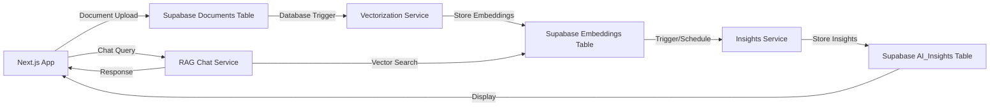

# RAG Pipeline System - Proper Architecture

## 🎯 System Overview

This is a **3-component RAG pipeline system**:
1. **Document Vectorization Service** (Supabase trigger → embeddings)
2. **Insights Generation Pipeline** (embeddings → AI insights → Supabase)
3. **RAG Chat Agent** (Next.js frontend + RAG backend)

## 🏗️ Recommended Structure

```
rag-pipeline-system/
├── README.md
├── docker-compose.yml          # Orchestrate all services
├── .env.example
├── .gitignore
│
├── services/
│   ├── vectorization/          # Service 1: Document → Embeddings
│   │   ├── Dockerfile
│   │   ├── requirements.txt
│   │   ├── src/
│   │   │   ├── __init__.py
│   │   │   ├── main.py        # FastAPI webhook endpoint
│   │   │   ├── vectorizer.py  # Embedding generation
│   │   │   ├── supabase_client.py
│   │   │   └── config.py
│   │   └── tests/
│   │
│   ├── insights/               # Service 2: Embeddings → Insights
│   │   ├── Dockerfile
│   │   ├── requirements.txt
│   │   ├── src/
│   │   │   ├── __init__.py
│   │   │   ├── main.py        # Scheduled/triggered service
│   │   │   ├── insights_generator.py
│   │   │   ├── embedding_analyzer.py
│   │   │   ├── supabase_client.py
│   │   │   └── config.py
│   │   └── tests/
│   │
│   └── rag-chat/              # Service 3: RAG Chat API
│       ├── Dockerfile
│       ├── requirements.txt
│       ├── src/
│       │   ├── __init__.py
│       │   ├── main.py        # FastAPI chat endpoints
│       │   ├── rag_agent.py   # Main chat agent
│       │   ├── retrieval/
│       │   │   ├── __init__.py
│       │   │   ├── vector_search.py
│       │   │   ├── hybrid_search.py
│       │   │   └── context_builder.py
│       │   ├── chat/
│       │   │   ├── __init__.py
│       │   │   ├── conversation_manager.py
│       │   │   └── response_generator.py
│       │   ├── tools/
│       │   │   ├── __init__.py
│       │   │   └── search_tools.py
│       │   └── config.py
│       └── tests/
│
├── shared/                     # Shared utilities across services
│   ├── __init__.py
│   ├── supabase/
│   │   ├── __init__.py
│   │   ├── client.py          # Common Supabase connection
│   │   ├── models.py          # Pydantic models for tables
│   │   └── schema.sql         # Database schema
│   ├── ai/
│   │   ├── __init__.py
│   │   ├── providers.py       # LLM providers (OpenAI, etc.)
│   │   └── embeddings.py      # Embedding utilities
│   └── utils/
│       ├── __init__.py
│       ├── logging.py
│       └── config.py
│
├── infrastructure/
│   ├── supabase/
│   │   ├── migrations/        # Database migrations
│   │   ├── functions/         # Edge functions
│   │   └── triggers/          # Database triggers
│   ├── deployment/
│   │   ├── railway.json
│   │   ├── fly.toml
│   │   └── k8s/              # If using Kubernetes
│   └── monitoring/
│       ├── health_checks.py
│       └── metrics.py
│
├── scripts/                    # Deployment & maintenance scripts
│   ├── deploy.py
│   ├── setup_database.py
│   ├── migrate.py
│   └── test_pipeline.py
│
├── tests/                      # Integration tests
│   ├── __init__.py
│   ├── conftest.py
│   ├── test_pipeline_integration.py
│   ├── test_vectorization_flow.py
│   ├── test_insights_flow.py
│   └── test_rag_chat_flow.py
│
├── docs/
│   ├── architecture.md
│   ├── deployment.md
│   ├── api-reference.md
│   └── development.md
│
└── frontend-integration/       # Next.js integration helpers
    ├── types/
    │   ├── supabase.ts        # Generated types
    │   └── insights.ts        # Insights types
    ├── api/
    │   ├── chat-client.ts     # RAG chat client
    │   └── insights-client.ts # Insights fetching
    └── components/
        ├── chat-interface.tsx
        └── insights-display.tsx
```

## 🔄 Data Flow Architecture



## 🚀 Service Breakdown

### 1. Vectorization Service
**Purpose**: Convert new documents to embeddings
```python
# services/vectorization/src/main.py
from fastapi import FastAPI
from .vectorizer import DocumentVectorizer
from .supabase_client import SupabaseClient

app = FastAPI()

@app.post("/webhook/vectorize")
async def vectorize_document(payload: dict):
    # Triggered by Supabase when new document added
    doc_id = payload["record"]["id"]
    content = payload["record"]["content"]
    
    # Generate embeddings
    embeddings = await DocumentVectorizer.create_embeddings(content)
    
    # Store in Supabase
    await SupabaseClient.store_embeddings(doc_id, embeddings)
    
    return {"status": "vectorized", "doc_id": doc_id}
```

### 2. Insights Generation Service
**Purpose**: Analyze embeddings to create project insights
```python
# services/insights/src/main.py
from fastapi import FastAPI
from .insights_generator import InsightsGenerator

app = FastAPI()

@app.post("/generate-insights")
async def generate_project_insights(project_id: str):
    # Fetch related embeddings
    embeddings = await fetch_project_embeddings(project_id)
    
    # Generate insights using AI
    insights = await InsightsGenerator.analyze_embeddings(embeddings)
    
    # Store in ai_insights table
    await store_insights(project_id, insights)
    
    return {"status": "completed", "insights_count": len(insights)}
```

### 3. RAG Chat Service
**Purpose**: Provide conversational AI with document context
```python
# services/rag-chat/src/main.py
from fastapi import FastAPI
from .rag_agent import RAGAgent

app = FastAPI()

@app.post("/chat")
async def chat_endpoint(query: str, context: dict):
    # Retrieve relevant documents
    relevant_docs = await RAGAgent.retrieve_context(query)
    
    # Generate response with context
    response = await RAGAgent.generate_response(query, relevant_docs)
    
    return {"response": response, "sources": relevant_docs}
```

## 🔧 Configuration Strategy

### Environment Variables by Service
```bash
# Vectorization Service
SUPABASE_URL=
SUPABASE_ANON_KEY=
OPENAI_API_KEY=
EMBEDDING_MODEL=text-embedding-3-small

# Insights Service  
SUPABASE_URL=
SUPABASE_SERVICE_KEY=  # Needs write access
OPENAI_API_KEY=
INSIGHTS_MODEL=gpt-4

# RAG Chat Service
SUPABASE_URL=
SUPABASE_ANON_KEY=
OPENAI_API_KEY=
CHAT_MODEL=gpt-4-turbo
```

## 📦 Deployment Strategy

### Option 1: Microservices (Recommended)
- Deploy each service independently
- Use Railway/Fly.io for individual services
- Scale services based on load

### Option 2: Monolith with Separation
- Single deployment with internal service separation
- Easier for small teams
- Still maintains clean architecture

## 🗄️ Supabase Integration

### Required Tables
```sql
-- Documents table (existing)
CREATE TABLE documents (
    id UUID PRIMARY KEY,
    content TEXT,
    metadata JSONB,
    created_at TIMESTAMP DEFAULT NOW()
);

-- Embeddings table
CREATE TABLE document_embeddings (
    id UUID PRIMARY KEY,
    document_id UUID REFERENCES documents(id),
    chunk_index INTEGER,
    embedding VECTOR(1536),
    content TEXT,
    created_at TIMESTAMP DEFAULT NOW()
);

-- AI Insights table  
CREATE TABLE ai_insights (
    id UUID PRIMARY KEY,
    project_id UUID,
    insight_type TEXT,
    content TEXT,
    confidence FLOAT,
    metadata JSONB,
    created_at TIMESTAMP DEFAULT NOW()
);
```

### Database Triggers
```sql
-- Trigger vectorization on new documents
CREATE OR REPLACE FUNCTION trigger_vectorization()
RETURNS TRIGGER AS $$
BEGIN
    -- Call vectorization webhook
    PERFORM net.http_post(
        'https://your-vectorization-service.com/webhook/vectorize',
        '{"record": ' || row_to_json(NEW) || '}'::jsonb
    );
    RETURN NEW;
END;
$$ LANGUAGE plpgsql;

CREATE TRIGGER vectorize_new_documents
    AFTER INSERT ON documents
    FOR EACH ROW
    EXECUTE FUNCTION trigger_vectorization();
```

## ✅ Migration from Current Structure

1. **Extract Services**: Move related functionality to service directories
2. **Shared Code**: Extract common utilities to `shared/`
3. **Frontend Integration**: Move Next.js components to `frontend-integration/`
4. **Infrastructure**: Consolidate deployment configs
5. **Testing**: Organize by service + integration tests

This structure properly reflects your RAG pipeline requirements while maintaining clean separation between vectorization, insights generation, and chat functionality.